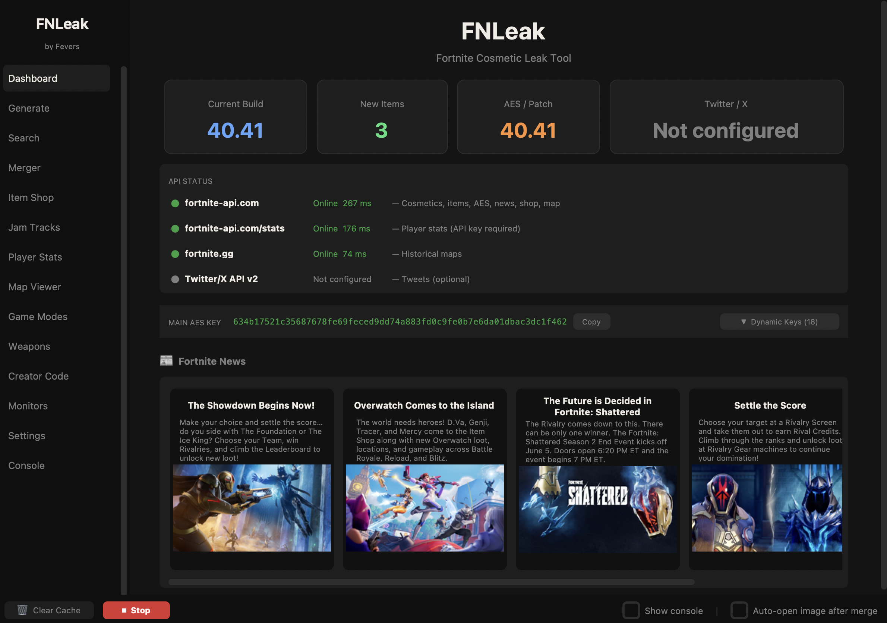

# FNLeak - Created by Fevers

> **Open-source. Locally run. Built for the community.**



---

## The Story

With the reveal of my journey into a creative in the Fortnite community, the past few weeks I've felt the same emotions when I was making it.

I was inspired to create something new — but this time, with the tools I didn't have back then. I focused on how and when to use AI.

**FNLeak** is my new, improved version of **[AutoLeak](https://github.com/FortniteFevers/AutoLeak)**. Simply put, FNLeak is one of a kind: an open-source, locally run program on both macOS and Windows that interacts with multiple Fortnite APIs to bring Fortnite content creation to anyone, regardless of their experience in the field.

Man, I wish I had this program years ago. I created it for me. That small kid with a dream.

---

## What is FNLeak?

FNLeak is a full-featured Fortnite datamining and content creation tool with a polished desktop GUI. Everything runs **locally on your machine** — no cloud subscription, no account required, no data sent anywhere except to the public Fortnite APIs it uses. Generate cosmetic cards, browse the Item Shop, look up player stats, view historical maps, browse weapons, run a loot simulator, and more — all from one app.

---

## What's New vs AutoLeak

| Area | AutoLeak (original) | FNLeak |
|---|---|---|
| Interface | Terminal menu only | Full dark-theme GUI |
| Platform | Windows-focused | macOS + Windows |
| Distribution | Run from source only | Standalone `.app` / `.exe` |
| Pillow support | Broke on Pillow 10+ | Pillow 10/11 fully compatible |
| Twitter/X | Tweepy v1 `update_with_media` (deprecated) | Tweepy v4, v2 API |
| Item Shop | Basic grid image | Section-by-section with NEW/LEAVING dates, Load Past Shop, dated folders |
| Jam Tracks | Not supported | Full browser with Spotify + Apple Music links |
| Player Stats | Not supported | Full stats card generation via fortnite-api.com (API key flow built in) |
| Map Viewer | Not supported | Current + all historical season maps with zoom/pan |
| Game Modes | Not supported | Full playlist browser with thumbnails |
| Weapons | Not supported | Full weapon browser + Loot Simulator + Random Loadout Generator |
| Merger | Basic grid | FModel-style picker with visual selection, custom background, watermark, preview |
| Creator Code | Not supported | SAC lookup + Island Analytics |
| Cache | None | Per-folder size stats, clear with confirmation dialog |
| Outdated APIs | FortniteAPI.io, BenBot | Removed — `fortnite-api.com` only |
| Monitors | Stack overflow risk (recursive retries) | Stable background threads |
| Code size | ~3,100 lines, heavily duplicated | Fully modular |

---

## Features

### Dashboard
Live status indicators for all APIs (fortnite-api.com, Fortnite Game Services, FortniteGG, Twitter/X). Quick-action buttons to jump to any page. Current AES key display with one-click copy. Live Fortnite news feed.

### Cosmetic Generator
Detect a new Fortnite update and auto-generate styled card images for every new cosmetic. Supports five card styles:
- **New** — Large centred name and description
- **Cataba** — Fortnite-style layered composite with backend type badge
- **Standard** — Centred name, description, and item ID
- **Clean** — Left-aligned minimal style
- **Large** — Featured image with variant styles section

Cards that have no official image automatically fall back to a custom local placeholder (`assets/fnleakplaceholder.png`) instead of the fortnite-api.com pink placeholder.

### Cosmetic Search
Search any cosmetic by name or ID. Click the thumbnail to open a fullscreen preview. Generate and save the card in any style directly from the search result.

### Item Shop Generator
Generate a full section-by-section image of the current Item Shop with:
- **Date header** at the top of the scroll view showing which shop is loaded (e.g. *May 12, 2024*)
- **Section headers** showing whether a set is **NEW** or **LEAVING** (with exact date/time popup on click)
- **V-Bucks icon** on every item price
- **Real-time progress bar** with estimated time remaining during generation
- **Copy button** per section — one click to copy that section's image to your clipboard
- **Dated subfolders** — each generation saves to `merged/YYYY-MM-DD/` automatically
- **Load Past Shop** — pick any previously generated date from a dropdown and reload it instantly
- **Open Folder** — opens the folder for the currently displayed shop date

### Jam Tracks
Browse all Jam Tracks currently in the shop with album art, artist info, and V-Buck price. Each track has:
- **Spotify** and **Apple Music** direct search links
- **Copy Post** button — pre-formatted social media text + copy text or album art image separately

### Player Stats
Look up any Fortnite player's lifetime stats by Epic username. Requires a free API key from [dash.fortnite-api.com](https://dash.fortnite-api.com) — the app walks you through setup with a first-visit popup and an inline banner until the key is configured. Generates a full styled stats card (1500×680) showing:
- Overall stats: K/D, Win Rate, Kills, KPM, Deaths, Matches, Wins
- Solo / Duo / Squad / LTM breakdowns
- Battle Pass level and progress bar
- Burbank font rendering

Handles **private stats** with a clear message rather than a generic error. Buttons: **Open Image**, **Copy Image**, **Tweet Stats**.

### Map Viewer
View the current season's live map or any historical season map (Chapter 1 Season 1 through the latest season, including Mini Seasons). Click the map to open a zoom window with:
- **+ / −** zoom buttons
- **◀ ▲ ▼ ▶** pan controls
- **Fit** button to reset the view
- Scroll wheel and drag support

### Game Modes
Browse all current Fortnite playlists with thumbnails and descriptions.

### Weapons
Full weapon browser with search and rarity filtering. Two sub-tabs:

**Weapons tab** — Browse all current BR weapons with images, DPS, damage, fire rate, magazine size, and reload time. Click any weapon for a detail popup.

**Loot Tools tab:**
- **Loot Simulator** — Roll a randomised loot pool with adjustable per-rarity weights. See results as card images with rarity colors.
- **Random Loadout Generator** — Generate a random full loadout (Assault Rifle, Shotgun, SMG/Pistol, Sniper/Explosive, Wild Card) with weighted rarity distribution and weapon stats.

### Merger
FModel-style image picker for building custom cosmetic grids:
- Browse and pick images from the `icons/` folder (or any folder)
- **Visual selection indicator** — checkmark and colored border on selected images
- Select All / Deselect All
- Adjustable column count and scale
- Light / Dark / Custom background color
- Optional watermark image overlay
- Live preview before export
- One-click merge and save

### Creator Code
Look up any Support-a-Creator code and view earnings stats.

**Island Analytics** (built into the same page) — Enter any Fortnite Creative island code (auto-formats as XXXX-XXXX-XXXX) and view:
- Island title, description, and creator
- Play count and favorites
- Thumbnail image
- Version and last-updated date

### Monitors
Set up background watchers that auto-run and optionally tweet when triggered:
- **Update** — Detects a new Fortnite patch
- **BR News** — Monitors the Battle Royale news feed
- **Notices** — Monitors Fortnite emergency notices
- **Staging** — Detects Epic's pre-release version bumps
- **Shop Sections** — Monitors Item Shop section layout changes

### Twitter / X Integration
Connect your Twitter/X developer account and tweet generated images directly from the app. Supports tweeting cosmetic cards, merged grids, shop sections, and player stats.

### Settings
Configure everything from the GUI:
- Name / footer / language
- Card style and fonts
- Player Stats API key (fortnite-api.com — stored securely, shown as `•••`)
- Twitter/X API credentials
- Merge options and bot delay
- **Cache management** — shows file count and size for Weapon Images, Icons folder, Merged folder, and Cache folder total. Clear weapon cache or all cache (with confirmation dialog).

### Console
Live scrollable log output from all background operations.

---

## Installation

### macOS — Standalone App (Recommended)

1. Download **`FNLeak-v1.2.0-macOS.zip`** from the [Releases](../../releases) page
2. Unzip and drag **`FNLeak.app`** anywhere — Desktop, Applications, Downloads — it doesn't matter
3. **First launch only:** macOS will block the app because it isn't from the App Store. To open it:
   - Right-click `FNLeak.app` → click **Open** → click **Open** in the dialog
   - You only need to do this once
4. The app sets itself up automatically on first launch

> **Where does FNLeak store its data?**
> Generated images, cache, and settings live alongside the app folder.
> Everything is created automatically — you never need to touch it manually.

### Running from Source (macOS)

**First-time setup (do this once):**

```bash
chmod +x /path/to/FNLeak/run.command
```

After that, **double-click `run.command`** in Finder to launch FNLeak.

> Requires **Python 3.10+** — download from [python.org](https://www.python.org/downloads/) if needed.

### Running from Source (Windows)

**Double-click `run.bat`** in File Explorer.

> Requires **Python 3.10+** — during installation, check **"Add Python to PATH"**.

---

## Configuration

Use the **Settings** page in the GUI, or edit `json/settings.json` directly.

```json
{
  "name":        "YourLeakName",
  "language":    "en",
  "iconType":    "new",
  "watermark":   "",
  "apikey":      "",

  "twitAPIKey":              "",
  "twitAPISecretKey":        "",
  "twitAccessToken":         "",
  "twitAccessTokenSecret":   "",

  "MergeImages":      true,
  "AutoTweetMerged":  false,
  "BotDelay":         30
}
```

| Key | Default | Description |
|---|---|---|
| `name` | `"FNLeak"` | Label shown in tweets and filenames |
| `footer` | `"#Fortnite"` | Appended to all tweets |
| `language` | `"en"` | Cosmetic language (`en`, `de`, `fr`, `es`, `ja`, `ko`, `ru`, `zh-CN`, …) |
| `iconType` | `"new"` | Card style: `new` / `cataba` / `standard` / `clean` / `large` |
| `imageFont` | `"BurbankBigCondensed-Black.otf"` | Main card font (place in `fonts/`) |
| `sideFont` | `"OpenSans-Regular.ttf"` | Secondary font (place in `fonts/`) |
| `watermark` | `""` | Text drawn on every card |
| `useFeaturedIfAvailable` | `false` | Prefer featured image over icon |
| `apikey` | `""` | fortnite-api.com key for Player Stats (free at dash.fortnite-api.com) |
| `MergeImages` | `true` | Auto-merge all cards into a grid after generation |
| `AutoTweetMerged` | `false` | Auto-tweet the merged image |
| `BotDelay` | `30` | Seconds between monitor poll checks |
| `twitAPIKey` / `twitAPISecretKey` | `""` | Twitter/X API credentials |
| `twitAccessToken` / `twitAccessTokenSecret` | `""` | Twitter/X access credentials |

---

## Twitter / X Setup

1. Go to [developer.twitter.com](https://developer.twitter.com) and create a project + app
2. Under **Keys and Tokens**, generate your API Key, Secret, Access Token, and Access Token Secret
3. Paste them into the **Settings** page in FNLeak (or directly into `settings.json`)
4. **Note:** Media uploads require **Elevated access** — apply for it in the developer portal. Elevated access is free but requires manual approval and can take several days.

---

## Player Stats Setup

Player Stats uses the `fortnite-api.com` stats endpoint which requires a free API key.

1. Go to [dash.fortnite-api.com](https://dash.fortnite-api.com)
2. Sign up / log in
3. Copy your API key
4. Paste it into **Settings → Player Stats** in FNLeak

FNLeak will prompt you with a step-by-step popup the first time you visit the Player Stats page without a key configured.

---

## APIs Used

| API | Used For |
|---|---|
| [fortnite-api.com](https://fortnite-api.com) | Cosmetics, new items, AES keys, news, shop, playlists, map, jam tracks, weapons, player stats |
| [fortnite.gg](https://fortnite.gg) | Historical season map images |
| [Twitter/X API v2](https://developer.twitter.com) | Tweet posting and media upload (optional) |

---

## Project Structure

```
FNLeak/
├── gui.py                 # Main GUI entry point (CustomTkinter)
├── bot.py                 # Terminal CLI entry point
├── requirements.txt       # Python dependencies
├── run.command            # macOS launch script (double-click to run)
├── run.bat                # Windows launch script (double-click to run)
│
├── ALmodules/
│   ├── image_gen.py       # Cosmetic card generation (all 5 styles) + placeholder detection
│   ├── shop.py            # Item Shop + Jam Tracks + shop history
│   ├── stats_gen.py       # Player stats card generation (fortnite-api.com)
│   ├── merger.py          # Grid image merger
│   ├── compressor.py      # Image compression for Twitter size limits
│   ├── twitter_client.py  # Tweepy v4 wrapper
│   ├── monitors.py        # Background watchers (update/news/staging/shop)
│   └── setup.py           # First-run setup (directories + rarity assets)
│
├── assets/
│   ├── overlay.png              # Dark gradient overlay for shop cards
│   ├── vbuck.png                # V-Bucks icon
│   └── fnleakplaceholder.png    # Custom placeholder for missing cosmetic images
│
├── fonts/                 # Place your .otf / .ttf fonts here
├── rarities/              # Auto-generated rarity background PNGs
├── icons/                 # Output: individual cosmetic card images
├── merged/
│   └── YYYY-MM-DD/        # Output: shop section images, one folder per date
│       ├── shop_*.jpg
│       └── shop_meta.json
├── cache/                 # Cache: downloaded weapon images (wpn_*.png)
└── json/
    ├── settings.json      # User configuration (auto-created on first launch)
    └── shop_history.json  # Item Shop section history (auto-managed)
```

---

## Requirements (source install)

| Package | Version |
|---|---|
| Python | 3.10+ |
| Pillow | 10.0+ |
| requests | 2.31+ |
| colorama | 0.4.6+ |
| tweepy | 4.14+ |
| customtkinter | 5.2+ |

---

## License

Open-source for **educational and personal use**.

> All cosmetic images, names, and game assets are the property of **Epic Games**.
> FNLeak uses publicly available third-party APIs and does not bypass any access controls or terms of service.

---

## Credits

**Created by Fevers** ([@FortniteFevers](https://github.com/FortniteFevers))

Original project: **[AutoLeak](https://github.com/FortniteFevers/AutoLeak)**

Rebuilt using **[Claude Code](https://claude.ai/claude-code)** by Anthropic — the ideas, original logic, architecture, and feature set are entirely the work of Fevers (me!!!).

---

## Support

Issues? Questions? Feature requests?

- **Discord:** [dsc.gg/autoleak](https://dsc.gg/autoleak)
- **GitHub Issues:** [open an issue](../../issues)
